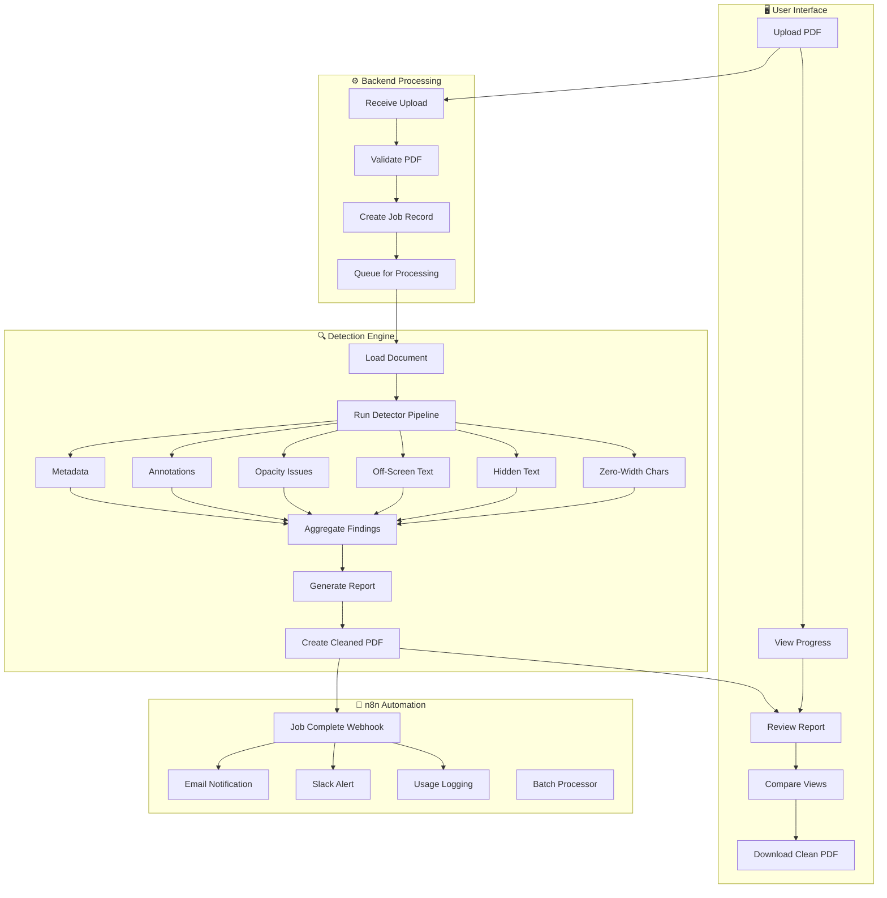
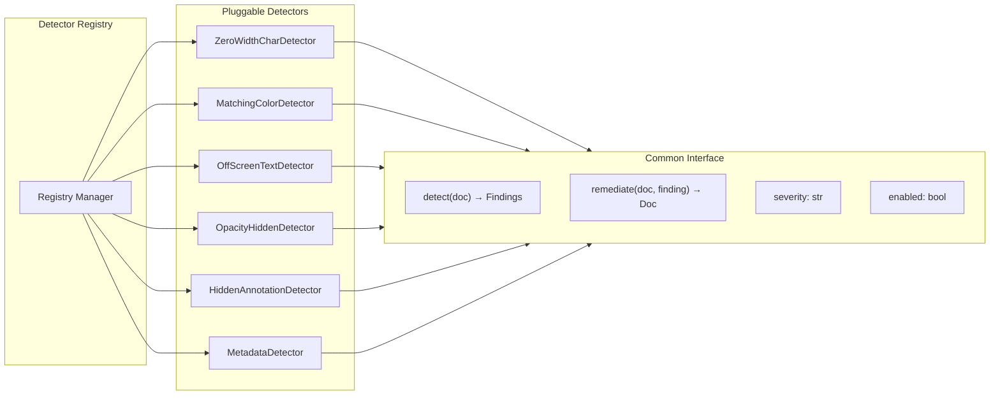
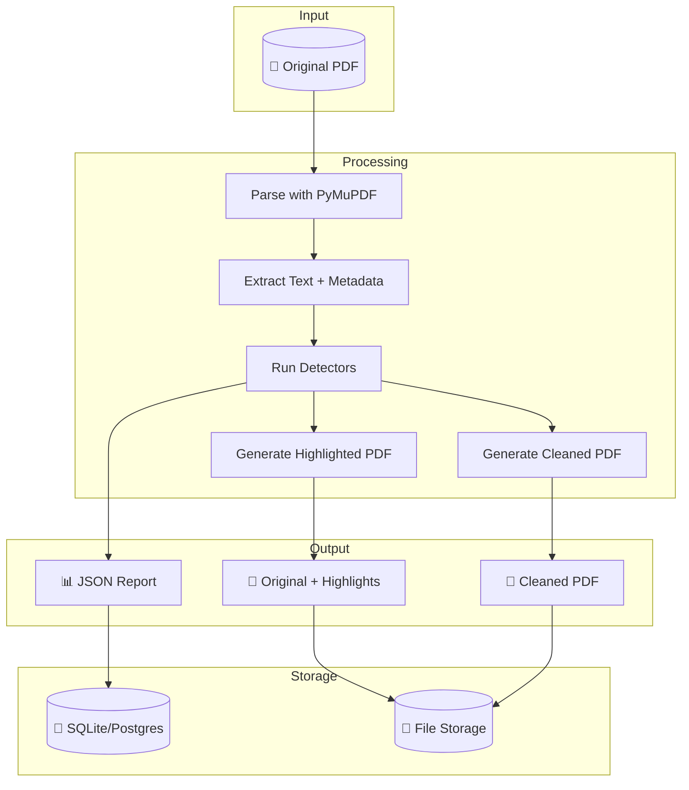
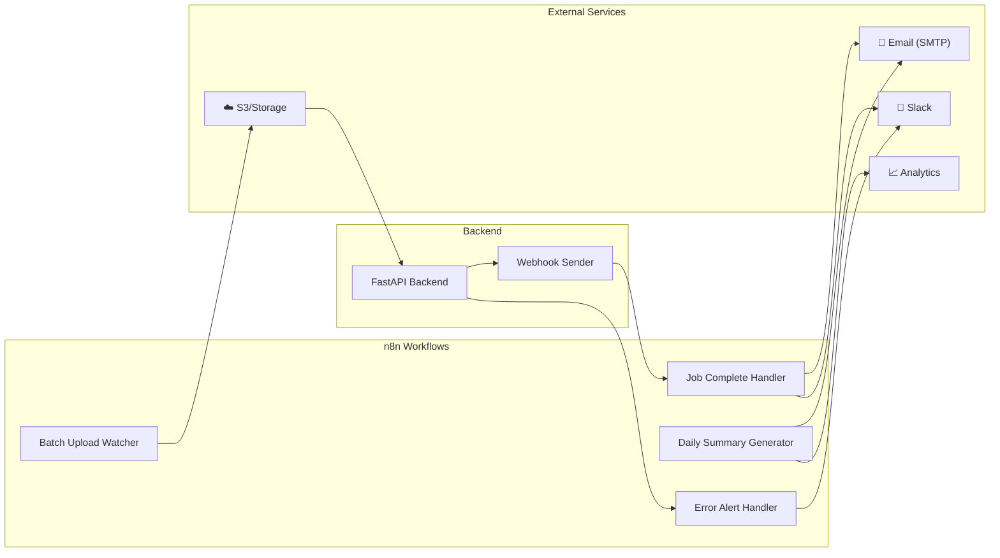
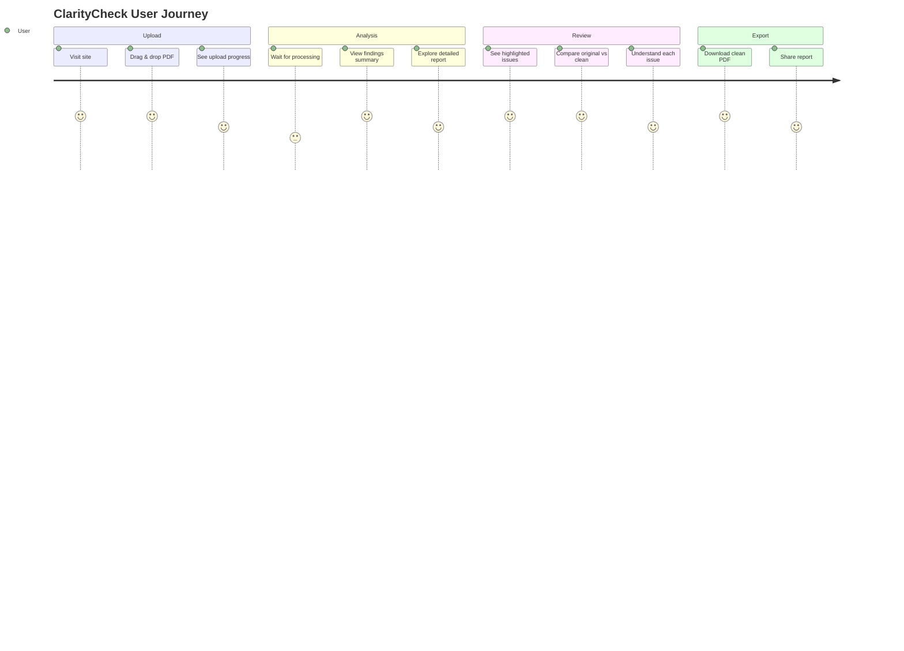
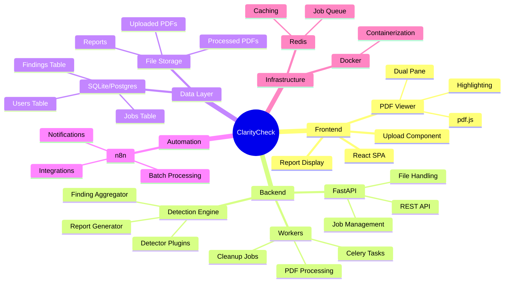
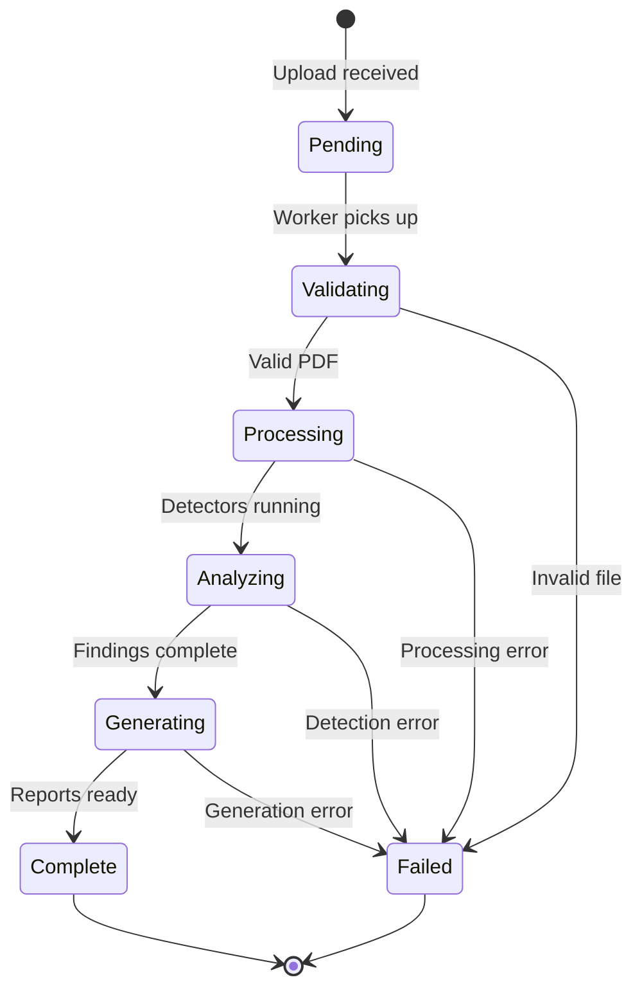

# ClarityCheck Workflow Mindmap

## Core Processing Flow

## Detection Module Architecture

## Data Flow

## n8n Integration Points

## User Journey

## Component Mindmap

## State Machine: Job Processing

